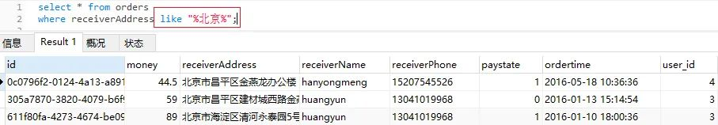
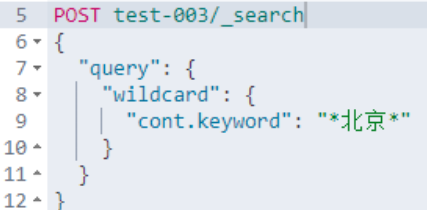
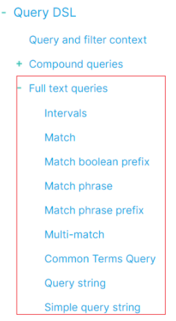
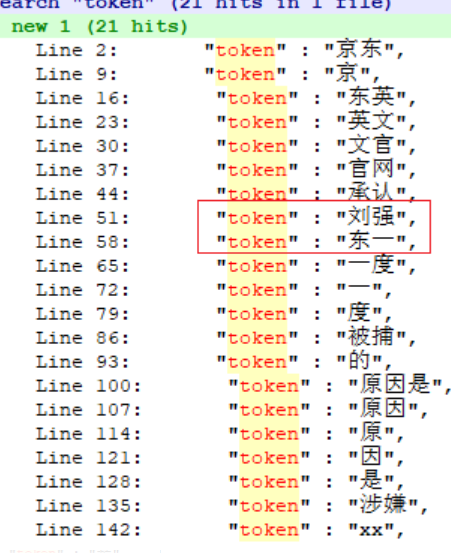
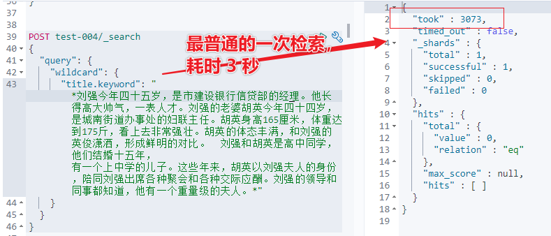
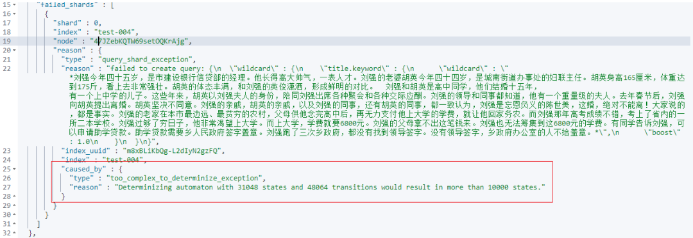

# Elasticsearch 警惕使用 wildcard 检索！然后呢？

## 1. wildcard 检索定义

wildcard 检索可以定义为：支持通配符的模糊检索。

类似 Mysql 中的 like 模糊匹配，如下所示：



Elasticsearch 中的 wildcard 使用方式如下：




通配符运算符是匹配一个或多个字符的占位符。

通配符支持两种：

- ? : 支持模糊匹配单个字符。举例：Ma?s 仅能匹配：Mars, Mass, 和 Maps。

- : 支持模糊匹配零个或者多个字符。举例：Ma*s 能匹配：Mars, Matches 和 Massachusetts等。


## 2. 全局视野——wildcard 检索所处位置

全局认知非常重要，检索核心类型大致（非严谨、精确）分为：精准匹配检索（Term-level queries）和基于分词的全文匹配检索（Full text queries）。

全文匹配检索细分如下：



精准匹配检索细分如下：


也就是：wildcard 是和Term、Terms检索平级的检索。

## 3. wildcard 检索适用场景

适用于：召回率要求高的业务场景。

基于分词的全文检索，可能会导致明明存在，但是检索不到。可能的原因如下：

- 原因1：基础词库不完备；

- 原因2：分词粒度不精确。


举个例子一看就明白了：

前置说明：

- 1、纯属举例，不涉及针对具体人。
- 2、Ik 词典main.dic 非原生，做了互联网词库的扩展，但词库中依然没有“刘强东”三个字。

- 3、如果你在本地测试结果和文章不一致，极大可能是词典不一样导致的。

```json
PUT test-004
{
  "mappings": {
    "properties": {
      "title": {
        "type": "text",
        "analyzer": "ik_max_word",
        "fields": {
          "keyword": {
            "type": "keyword"
          }
        }
      }
    }
  }
}

POST test-004/_bulk
{"index":{"_id":1}}
{"title":"英文官网承认刘强东一度被捕的原因是涉嫌XX"}
{"index":{"_id":2}}
{"title":"别提了朋友哥哥刘强东窗事发了"}
{"index":{"_id":3}}
{"title":"刘强东施效颦，没想到竟然收获了流量"}
{"index":{"_id":4}}
{"title":"刘强东是谁？我不认识"}


POST test-004/_search
{
  "query": {
    "match_phrase": {
      "title": "刘强东"
    }
  }
}
```


用的短语检索 match_phrase，搜索结果如下：


原因说明，analyzer API 能说明一切。

```json
POST test-004/_analyze
{
  "text": [
    "京东英文官网承认刘强东一度被捕的原因是涉嫌XX"
  ],
  "analyzer": "ik_max_word"
}
```

分词结果如下：



面对如上召回情况，部分不追求精准率只追求召回率的业务场景，可能会需要文档_id = 1、2、3、4 全部都要召回。

这时候，如果不改变分词的情况下，可能的解决方案之一就是：wildcard 检索实现。

```json
POST test-004/_search
{
  "query": {
    "wildcard": {
      "title.keyword": "*刘强东*"
    }
  }
}
```

如上的方式，文档1、2、3、4全部召回。

相当于在原有DSL的基础上，只改动检索方式和字段名称就搞定了产品经理的提高召回率的需求。

貌似，可以交差大吉了。实则，有非常大的隐患。

## 4. wildcard 可能的风险

官方文档是这么说的：


中文含义是：避免以*或？开头的模式。这会增加查找匹配项所需的迭代次数并降低搜索性能。

wildcard 到底有多慢？如下示例可见一斑：



wildcard 检索字段指定的字符数多了以后，会报错如下：



在 wood 大叔 2017年的文章中，曾经指出如下的核心点：

### 4.1 出现问题

用户输入的字符串长度没有做限制，导致首尾通配符中间可能是很长的一个字符串。后果就是对应的wildcard Query执行非常慢，非常消耗CPU。

### 4.2 根本原因

为了加速通配符和正则表达式的匹配速度，Lucene4.0开始会将输入的字符串模式构建成一个DFA (Deterministic Finite Automaton)，带有通配符的pattern构造出来的DFA可能会很复杂，开销很大。

源码及细节推荐阅读：

https://elasticsearch.cn/article/171

https://elasticsearch.cn/article/186

## 5. wildcard 实战中的悲剧

如下，采用原汁原味的技术群交流内容，更具有说服力。

更能警示大家：慎用 Wildcard！

### 5.1 悲剧1：一味的满足产品经理的需求，wildcard 不考虑性能的乱用。


### 5.2 悲剧2：wildcard 参数传了一篇文章进来，导致集群宕机！


### 5.3 悲剧3：wildcard 搜索一百个汉字，导致CPU利用率 100%！

注意是：不同100个字组合，一直搜。


### 5.4 悲剧4：客户现场演示，集群宕机！

根因：bool 组合了近 100 组+ wildcard 不同关键词的检索。

## 6. wildcard 可能的替代方案

在寻求解决方案的时候，我们要先问一下：为什么大家喜欢用 wildcard 实现模糊检索?

得到的答复往往是：顺手，类似Mysql like 查询，短、平、快的达到了产品经理的要求，满足了项目需求。

但，这忽略了性能问题以及可能带来的灾难后果。

所以，解决方案应该从根源上入手，以寻求彻底解决。

### 6.1 替代方案一：写入时分词优化，使用 Ngram 分词

更细粒度分词，更有利于数据的召回！

```json
PUT test-005
{
  "settings": {
    "index.max_ngram_diff": 10,
    "analysis": {
      "analyzer": {
        "my_analyzer": {
          "tokenizer": "my_tokenizer"
        }
      },
      "tokenizer": {
        "my_tokenizer": {
          "type": "ngram",
          "min_gram": 3,
          "max_gram": 10,
          "token_chars": [
            "letter",
            "digit"
          ]
        }
      }
    }
  },
  "mappings": {
    "properties": {
      "title": {
        "type": "text",
        "analyzer": "my_analyzer",
        "fields": {
          "keyword": {
            "type": "keyword"
          }
        }
      }
    }
  }
}

POST test-005/_bulk
{"index":{"_id":1}}
{"title":"英文官网承认刘强东一度被捕的原因是涉嫌性侵"}
{"index":{"_id":2}}
{"title":"别提了朋友哥哥刘强东窗事发了"}
{"index":{"_id":3}}
{"title":"刘强东施效颦，没想到竟然收获了流量"}
{"index":{"_id":4}}
{"title":"刘强东是谁？我不认识"}

POST test-005/_search
{
  "query": {
    "match_phrase": {
      "title": "刘强东"
    }
  }
}
```

Ngram 实现推荐：

[Elasticsearch能检索出来，但不能正确高亮怎么办？](http://mp.weixin.qq.com/s?__biz=MzI2NDY1MTA3OQ%3D%3D&chksm=eaa82d7edddfa4682a2ff4de9465d8d6fc99a6f925c3f018c0e77b6ee8f59406c687854648cf&idx=1&mid=2247484758&scene=21&sn=1fa663c5f8b85a82ef25f8453af88394#wechat_redirect)

### 6.2 替代方案二：7.9 + 以上的版本，使用 wildcard 数据类型

wildcard 类型出现的目的：一方面避免了某些场景下分词查询不准确的问题，另一方面也解决了通配符和正则检索的效率问题。

注意：新上的数据类型 wildcard，而非 wildcard 检索。

使用方法参见：

https://www.elastic.co/guide/en/elasticsearch/reference/master/keyword.html#wildcard-field-type。

### 6.3 禁用方案：禁止使用wildcard 模糊检索

特殊业务场景需要禁止：wildcard 检索。

实现如下：

PUT _cluster/settings
{
  "transient": {
    "search.allow_expensive_queries": false
  }
}
需要强调的是：

"search.allow_expensive_queries"  是 7.7+ 版本才有的功能，早期版本会报错。

#### 6.3.1 wildcard

在内部，`wildcard`字段使用 ngram 索引整个字段值并存储完整字符串。该索引用作粗略过滤器，以减少值的数量，然后通过检索和检查完整值来检查这些值。该字段特别适合在日志行上运行类似 grep 的查询。存储成本通常低于`keyword` 字段的成本，但完整术语的精确匹配的搜索速度较慢。如果字段值共享许多前缀，例如同一网站的 URL，则字段的存储成本`wildcard`可能会高于等效`keyword`字段。

```json
PUT my-index-000001
{
  "mappings": {
    "properties": {
      "my_wildcard": {
        "type": "wildcard"
      }
    }
  }
}

PUT my-index-000001/_doc/1
{
  "my_wildcard" : "This string can be quite lengthy"
}

GET my-index-000001/_search
{
  "query": {
    "wildcard": {
      "my_wildcard": {
        "value": "*quite*lengthy"
      }
    }
  }
}
```


## 7. 小结

由于技术惯性，我们习惯于相同或者相通技术的技术迁移，比如：mysql like 查询迁移到 Elasticsearch 中的 wildcard 模糊检索。但迁移的时候一定要注意：不同技术点的实现差异，同时要多关注技术点不能可能导致的性能问题。

即便 2017年 wood 大叔就发了两篇文章让大家警惕 wildcard 模糊检索可能带来的性能问题。但四年后的今天，仍然很多公司的实战业务中还未考虑性能及后果的前提下，乐此不疲的用着 wildcard 检索！

所以，本文算是 wood 大叔的 wildcard 警示文章接力，希望更多人看到。

参考：

https://t.zsxq.com/Y3zv7Eq

https://t.zsxq.com/bm62zZf

推荐：

1. [如何系统的学习 Elasticsearch ？](http://mp.weixin.qq.com/s?__biz=MzI2NDY1MTA3OQ%3D%3D&chksm=eaa8237edddfaa6828367df84d3697e99f3f3023d544bfb3446d9fe45d7b2e5e8ea0c89a4cbb&idx=1&mid=2247486294&scene=21&sn=50b43356e3a236df90773b4991819a9d#wechat_redirect)
2. [从实战中来，到实战中去——Elasticsearch 技能更快提升方法论](http://mp.weixin.qq.com/s?__biz=MzI2NDY1MTA3OQ%3D%3D&chksm=eaa8212fdddfa83971256372954149237242f94d5bbb6b48800d4a67b27bd96451d44c2b564b&idx=1&mid=2247485703&scene=21&sn=16342190747103ceacfd9e65b6fda27e#wechat_redirect)
3. [重磅 | 死磕 Elasticsearch 方法论认知清单（2020年国庆更新版）](http://mp.weixin.qq.com/s?__biz=MzI2NDY1MTA3OQ%3D%3D&chksm=eaa82f46dddfa650e3b982b977635dfeea3e5a4c91cc6df0641bacbcdf004dc2933d023a1018&idx=1&mid=2247485294&scene=21&sn=18fa621dd636a87852651c3b168d0dec#wechat_redirect)
4. [探究 | 明明存在，怎么搜索不出来呢？](http://mp.weixin.qq.com/s?__biz=MzI2NDY1MTA3OQ%3D%3D&chksm=eaa82b57dddfa241570730dde38b74a3ff9c36927fd84513b0136e4dc3ee7af18154290a27b2&idx=1&mid=2247484287&scene=21&sn=e1f4b24f61d37d556828bbcd211707ac#wechat_redirect)


------


原文链接：https://blog.csdn.net/laoyang360/article/details/115222329
