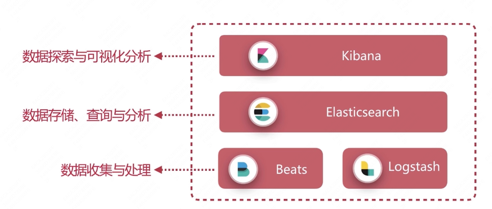
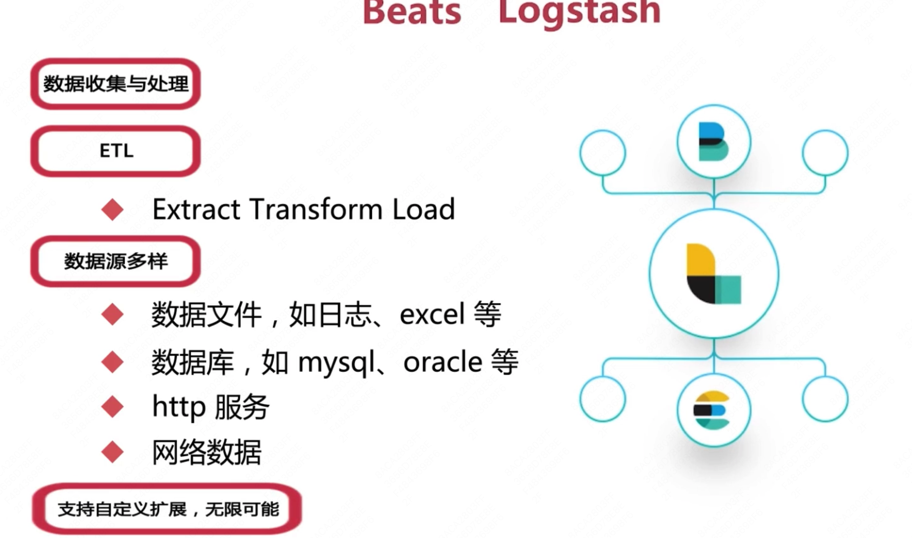

# 第1章 课程概述

[TOC]

## 1.1 Elastic Stack从入门到实践

- 性能好，查询快，实时展示结果
- 扩容方便，快速支撑增长迅猛的数据

## 1.2 目标人群

- 对大数据处理感兴趣，想要进入这个领域或者工作
- 对数据分析感兴趣，想要掌握一套展销易用的分析工具
- 正在使用Elastic Stack，想要进一步提升相关技术

## 1.3 前置知识

- 不要求有编程经验，但如果有一定的数据库知识和编程经验，会学习的更快一些

## 1.4 课程安排

### 1.4.1 Elasticsearch篇

- 什么是倒排序索引？它的组成是什么？
- 常见的相关性算分方法有哪些？
- 为什么查询语句没有返回预期的文档？
- 常用的数据类型有哪些？text 和 keyword 的区别是什么？
- 集群是如何搭建起来的？是如何实现故障转移的？
- Shard具体是由什么组成的？