# 第2章 Elasticsearch 篇之 入门

[TOC]

## 2.1 术语介绍

- 文档Document
  - 用户存储在es中的数据文档
- 索引Index
  - 由具有相同字段的文档列表组成
- 节点Node
  - 一个Elasticsearch的运行实例，是集群的构成单元
- 集群Cluster
  - 由一个或多个节点组成，对外提供服务


## 2.2 Document介绍

2.2.1 Docunment

- Json Object ，由字段（Field）组成，常见数据类型如下：
  - 字符串：text（分词）、keyword（不分词）
  - 数值型：long、integer、short、byte、double、float、half_float、scaled_float
  - 布尔：boolean
  - 日期：date
  - 二进制：binary
  - 范围类型：integer_range, float_range , long_range, double_range, date_range 

- 每个文档有唯一的id标识

  - 自行指定
  - es 自动生成

- 具体实例

  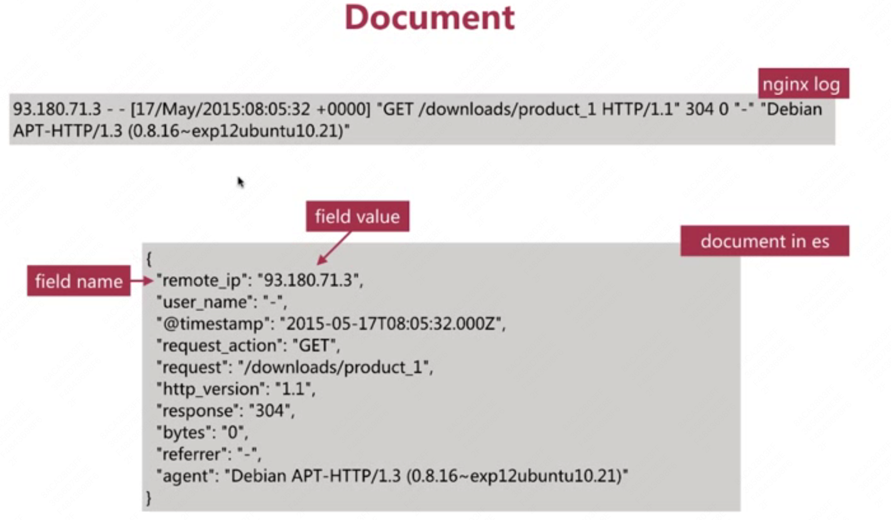

  

  

  


### 2.2.2 Docunment MetaData

元数据，用于标注文档的相关信息

- _index：文档所在的所有名

- _type：文档所在的类型名

- _id：文档唯一ID

- _uid：组合ID，由 _type 和 _id 组成（6.x _type不再起作用，同 _id 一样）

- _source：文档的原始 Json 数据，可以从这里获取每个字段的内容

- _all：整合所有字段内容到 该字段，默认禁用

  > 不推荐使用，因为是针对所有字段内容进行分词，比较占磁盘空间，查询效果也不好，在新的版本中，默认禁用

  

## 2.3 index介绍 

### 2.3.1 Index

- 索引中存储具有相同结果的文档（Document）
  - 每个索引都有自己的mapping定义，用于定义字段名和类型

- 一个集群可以有多个索引，比如：

  - Nginx日志存储的时候可以按照日期每天生成一个索引来存储

    Nginx-log-2017-01-01

    Nginx-log-2017-01-02

    Nginx-log-2017-01-03

    

## 2.4 Rest API介绍 

Elasticsearch 集群对外提供 RESTFULL API

- REST - REpresentational State Transfer 表现层状态转移，对资源进行操作后，状态会发生变化
- URI - 指定资源，如：Index 、Document 等
- Http Method 指明资源操作类型，如：GET 、 POST、PUT 、 DELETE等

常用两种交换方式：

- Curl 命令行

- Kibana Devtools

  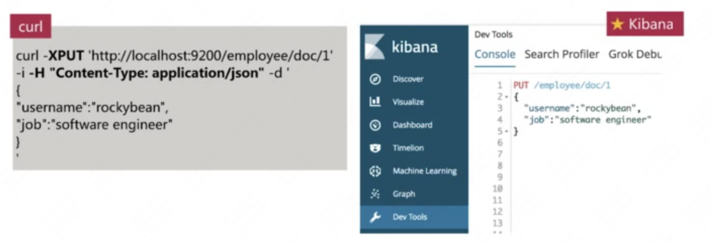


## 2.5 索引API

es有专门的 Index API，用于创建、更新、删除索引配置等

- 创建索引 api 如下：

  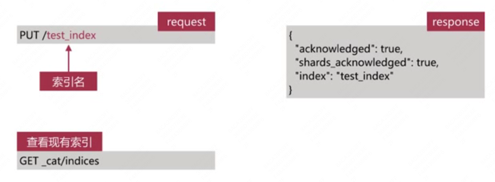


## 2.6 文档Document API

es有专门的Document API

- 创建文档
- 查询文档
- 更新文档
- 删除文档

### 2.6.1 创建文档API 

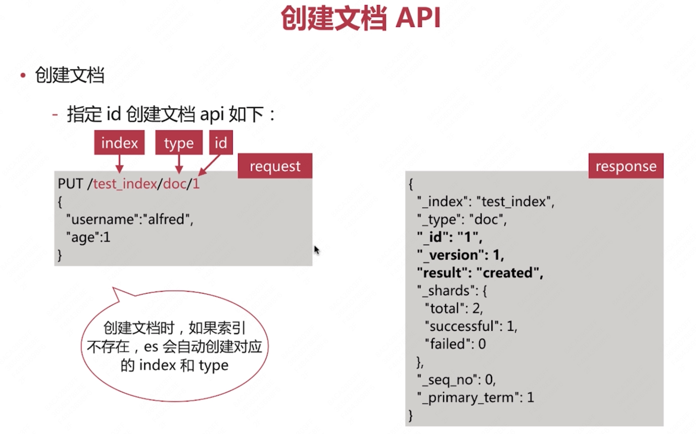

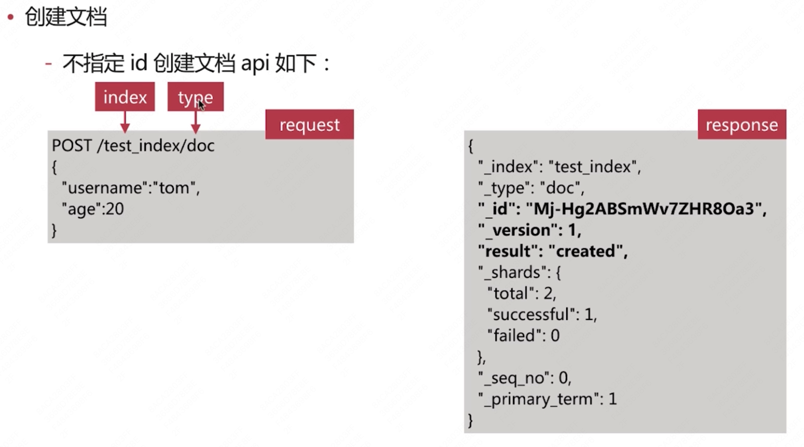

### 2.6.2 查询文档API

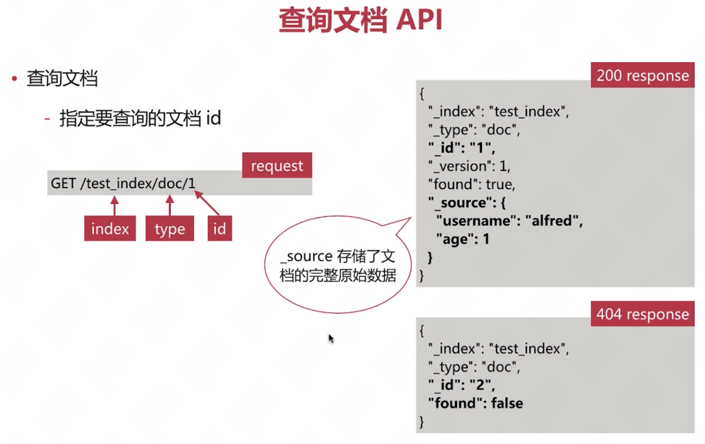

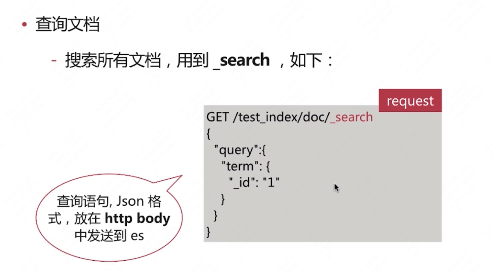

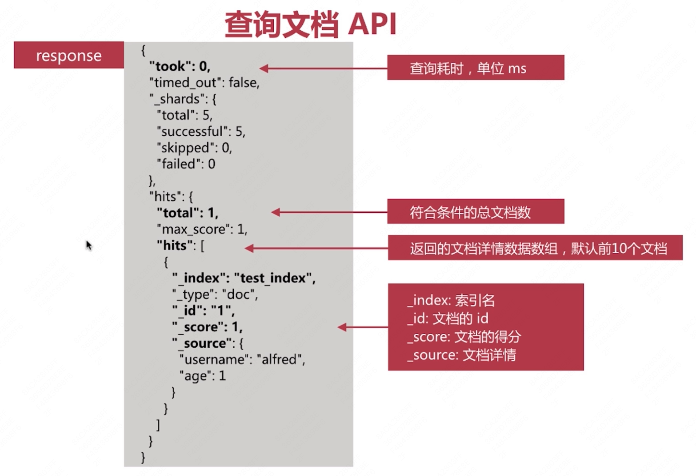

### 2.6.3 批量创建文档API

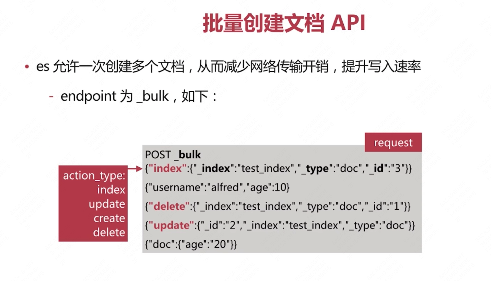

create ：只创建，当文档存在时，会报错；

index  ：即便文档存在，也会覆盖

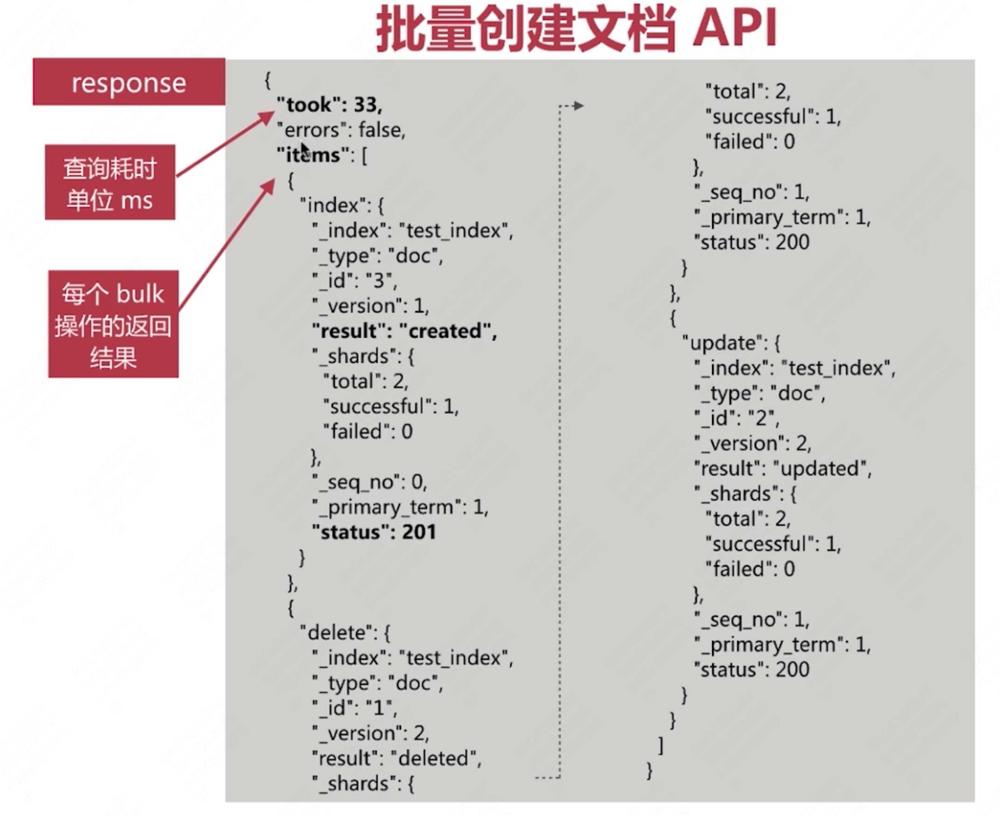

```json
#create index
PUT /test_index

GET /test_index


DELETE /test_index


POST /test_index/_doc/1
{
  "username":"alfred1",
  "age":1
}

GET /test_index/_doc/a-MoIIoBY2F2cWlom7kT

GET /test_index/_doc/1


GET /test_index/_search
{
  "query": {
    "term": {
      "age":20
    }
  }
}

GET /test_index/_search

POST _bulk
{"index":{"_index":"test_index","_id":"6"}}
{"username":"alfred6","age":26}
{"delete":{"_index":"test_index","_id":"3"}}
{"update":{"_id":"2","_index":"test_index"}}


POST _bulk
{"index":{"_index":"test_index","_id":"6"}}
{"username6":"alfred","age":26}


# multi_get
GET /_mget
{
  "docs": [
    {"_index": "test_index","_id": "5"},
    {"_index": "test_index","_id": "6"}
  ]
}

```

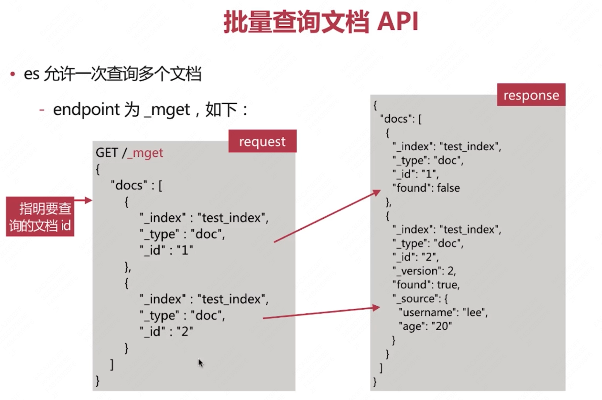


