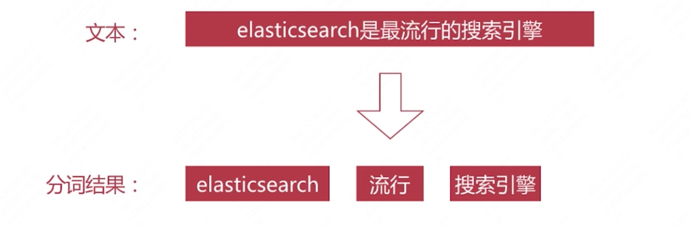

# 第3章 Elasticsearch 篇之倒排索引与分词

## 3.1 书的目录与索引

### 3.1.1 书与索引


如何查找”ACID“ 关键词所在页面：


###

目录页对应正排索引

索引页对应倒排索引

###  3.1.2 搜索引擎

正排索引

- 文档ID到文档内容、单词的关联关系

倒排索引

- 单词到文档ID的关联关系


## 3.2 正排与倒排索引简介

### 3.2.1 正排索引

文档ID到文档内容、单词的关联关系


### 3.2.2 倒排索引

文档到文档ID的关联关系


通过对文档内容进行分词：


### 3.2.3 倒排索引-查询流程

查询包含”搜索引擎“的文档

- 通过倒排索引获得”搜索引擎“对应的文档ID有1和3
- 通过正排索引查询1和3的完整内容
- 返回用户最终结果


## 3.3 倒排索引详解

### 3.3.1 倒排索引组成

倒排索引是搜索引擎的核心，主要包括2部分：

- 单词词典（Term Dictionary）
- 倒排列表（Posting list）

#### 3.3.1.1 单词词典

单词词典（Term Dictionary）是倒排索引的重要组成

- 记录所有文档的单词，一般比较大
- 记录单词到倒排列表的关联信息


单词词典的实现一般是用 B+ Tree，示例如下图：


#### 3.3.1.2 倒排列表

倒排列表（Posting List）记录了单词对应的的文档集合，由倒排索引项（Posting）组成

倒排索引项（Posting）主要包含如下信息：

- 文档id ，用于获取原始信息
- 单词频率（TF，Term Frequency），记录该单词在该文档中出现**次数**，用于后续**相关性算分**
- 位置（Position），记录单词在文档中的分词位置（多个），用于做词语搜索（Phrase Query）
- 偏移（Offset），记录单词在文档中的开始和结束位置，用于做高亮显示

以”搜索引擎“为例，如何构建Posting List的：


es存储的是一个json格式的文档，其中包含多个字段，**每个字段都会有自己的倒排序索引**：


## 3.4 分词

### 3.4.1 什么是分词

分词是将文本转换成一系列单词（term or token）的过程，也可以叫做文本分析，在es里面称Analysis，如下图所示：



### 3.4.2 分词器-组成

分词器是es中专门处理分词的组件，英文为 Analyzer，它的组成如下：

- Character Filter
  - 针对原始文本进行处理，比如去除 html 特殊标记符
- Tokenizer
  - 将原始文本按照一定规则切分单词
- Token Filter
  - 针对Tokenizer 处理的单词进行再加工，比如转小写、删除或新增（如：近义词、同义词）等处理

### 3.4.3 分词器-调用顺序


## 3.5 Analyze API

es提供了一个测试分词的api接口，方便验证分词效果，endpoint 是_analyze

- 可以直接指定analyzer进行测试
- 可以直接指定索引中的字段进行测试
- 可以自定义分词器进行测试


### 3.5.1 指定analyzer测试


示例：

```json
POST _analyze
{
  "analyzer": "standard",
  "text": "hello world! hello xiaojun"
}

```


### 3.5.2 指定索引字段测试


```
#create index
PUT /test_index

POST test_index/_analyze
{
  "field": "username",
  "text": "hello world!"
}
```


### 3.5.3 自定义分词器


tokenizer：指明要用那个分词器

filter：指明的Token Filter

```json
#自定义分词器
POST _analyze
{
  "tokenizer": "standard",
  "filter": ["lowercase"],
  "text":"Hello World!"
}

POST _analyze
{
  "tokenizer": "standard",
  "text":"Hello World!"
}
```


## 3.6 自带分词器

### 3.6.1 预定义的分词器

es 自带如下分词器

- Standard
- Simple
- Whitespace
- Stop
- Keyword
- Pattern
- Language

#### 3.6.1.1 Standard

Standard Analyzer：默认分词器，其组成如图：


Token Filter ：由上至下调用顺序

Stop：把stop word 去掉，默认是关闭的

**特性：**

- 按词切分，支持多语言
- 小写处理

```json
#分词器 ： standard
POST _analyze
{
  "analyzer": "standard",
  "text": "The 2 QUICK Brown-Foxes jumped over the lazy dog's bone"
}

```

#### 3.6.1.2 Simple

Simple Analyzer ，其特性如图：


特性：

- 按非字母切分（所以 - '  都被干掉）
- 小写处理

```json
#分词器 ： simple analyzer
POST _analyze
{
  "analyzer": "simple",
  "text": "The 2 QUICK Brown-Foxes jumped over the lazy dog's bone"
}
```


#### 3.6.1.3 Whitespace

Whitespace Analyzer：按空格切分


特性：

- 按照空格切分

```json
#分词器 ： whitespace
POST _analyze
{
  "analyzer": "whitespace",
  "text": "The 2 QUICK Brown-Foxes jumped over the lazy dog's bone"
}

```


#### 3.6.1.4 Stop

Stop Analyzer 

- Stop Word 指语气助词等修饰性的词语，比如：the、an、的、这等等

- 其组成如图：

  

- 特性：

  - 相比Simple Analyzer 多了Stop Word处理

```json
#分词器 ： stop

POST _analyze
{
  "analyzer": "stop",
  "text": "The 2 QUICK Brown-Foxes jumped over the lazy dog's bone"
}
```


#### 3.6.1.5 Keyword

Keyword Analyzer：

- 组成如图所示：

  

- 特性：

  - 不分词，直接将输入作为一个单词输出

```
#keyword
POST _analyze
{
  "analyzer": "keyword",
  "text": "The 2 QUICK Brown-Foxes jumped over the lazy dog's bone"
}

```

#### 3.6.1.6 Pattern

Pattern Analyzer


特性：

- 通过**正则表达式**自定义分割符
- 默认是 \W+，即非字词的符号作为分隔符

```json
#pattern
POST _analyze
{
  "analyzer": "pattern",
  "text": "The 2 QUICK Brown-Foxes jumped over the lazy dog's bone"
}

```

#### 3.6.1.7 Language 

Language Analyzer

- 提供了30+常见语言的分词器
- arabic、armenian、basque、bengali、brazilian、bulgarian、catalan、cjk、czech、danish、dutch、english


## 3.7 中文分词

### 3.7.1 难点

- 中文分词指的是将一个汉字序列切分成一个一个单独的词。在英文中，单词之间是以空格作为自然分界符，汉语中词没有一个形式上的分界符。
- 上下文不同，分词结果迥异，比如交叉歧义问题，比如下面2种分词都合理：
  - 乒乓球拍/卖/完了
  - 乒乓球/拍卖/完了
- https://mp.weixin.qq.com/s?__biz=MzU1NDA4NjU2MA==&mid=2247486148&idx=1&sn=817027a204650763c1bea3e837d695ea&source=41#wechat_redirect

### 3.7.2 中文分词

常见分词系统

- IK
  - 实现中英文单词的切分，支持 ik_smart、ik_maxword 等模式
  - 可自定义词库，支持更新分词词典
  - https://github.com/medcl/elasticsearch-analysis-ik
- jieba
  - python 中最流行的分词系统，支持分词和词性标注
  - 支持繁体分词、自定义词典、并行分词等
  - https://github.com/fxsjy/jieba

基于自然语言处理的分词系统

- Hanlp
  - 由一系列模型与算法组成的Java工具包，目标是普及自然语言处理在生产环境中的应用
  - https://github.com/hankcs/HanLP
- THULAC
  - THU Lexical Analyzer for Chinese ，由清华大学自然语言处理与社会人文计算实验室研制推出的一套中文词法分析工具包，具有中文分词和词性标注功能。
  - https://github.com/thunlp/THULAC-Python


## 3.8 自定义分词

当自带的分词无法满足需求时，可以自定义分词

 通过自定义Character Filter、Tokenizer 和 Token Filter实现


### 3.8.1 自定义分词之Character Filter

Character Filters

- 在Tokenizer 之前对原始文本进行处理，比如增加、删除和替换字符等
- 自带的如下：
  - HTML Strip 去除html 标签和转换html实体
  - Mapping 进行字符替换操作
  - Pattern Replace 进行正则匹配替换
- 会影响后续tokenizer 解析的 position 和 offset信息


示例：


```json
#自定义分词、自定义分词器
#通过自定义Character Filter 、Tokenizer 和 Token Filter 实现

POST _analyze
{
  "tokenizer": "keyword",
  "char_filter": ["html_strip"],
  "text":"<p>I&apos;m so <b>happy</b>!</p>"
}
```


### 3.8.2 自定义分词之Tokenizer

Tokenizer

- 将原始文本按照一定规则切分为单词（term or token）

- 自带的如下：

  - standard 按照单词进行分割

  - letter 按照非字符类进行分割

  - whitespace 按照空格进行分割

  - UAX URL Email 按照standard 分割，但不会分割邮箱和url

  - NGram 和 Edge NGram连词分割（自动提示，如Google智能列表）

  - Path Hierarchy按照文件路径进行分割

    

    ```json
    # path_hierarchy 针对文件路径进行切割
    # 输入文件路径进行匹配
    POST _analyze
    {
      "tokenizer": "path_hierarchy",
      "text": "/one/two/three"
    }
    ```

    

  

### 3.8.3 自定义分词之 Token Filter

Token Filter

- 对于Tokenizer输出的单词（term）进行增加、删除、修改等操作
- 自带的如下：
  - lowercase 将所有term 转换为小写
  - stop删除stop words
  - NGram 和 Edge NGram 连词分割
  - Synonym 添加近义词的term


```json
#自定义分词
POST _analyze
{
  "text":"a Hello,world!",
  "tokenizer": "standard",
  "filter": [
      "stop",
      "lowercase",
      {
        "type":"ngram",
        "min_gram":3,
        "max_gram":4
      }
    ]
}

```


## 3.9 自定义分词

### 3.9.1 自定义分词API

自定义分词需要在索引的配置中设定，如下所示：


```json
#自定义分词器
PUT test_index
{
  "settings": {
    "analysis": {
      "char_filter": {},
      "tokenizer": {},
      "filter": {},
      "analyzer": {}
    }
  }
}

DELETE test_index_1

#自定义分词器
PUT test_index_1
{
  "settings": {
    "analysis": {
      "analyzer": {
        "my_custom_analyzer":{
          "type":"custom",
          "tokenizer":"standard",
          "char_filter":["html_strip"],
          "filter":[
              "lowercase",
              "asciifolding"
              ]
        }
      }
    }
  }
}

POST test_index_1/_analyze
{
  "analyzer": "my_custom_analyzer",
  "text": "Is this <b>a box </b>?"
}

```


```
DELETE test_index_2

#复杂的自定义分词器
PUT test_index_2
{
    "settings": {
      "analysis": {
        "analyzer": {
          "my_custom_analyzer":{
          "type":"custom",
          "char_filter":["emoticons"],
          "tokenizer":"punctuation",
          "filter":[
            "lowercase",
            "english_stop"
            ]
          }
        },
            "tokenizer":{
            "punctuation":{
            "type":"pattern",
            "pattern":"[ .,!?]"
          }
        },
         "char_filter":{
        "emoticons":{
          "type":"mapping",
          "mappings":[
            ":) => _happy_",
            ":( ==> _sad_"
            ]
        }
      },
        "filter":{
        "english_stop":{
          "type":"stop",
          "stopwords":"_english_"
        }
      }
        
    }
  }
}

POST test_index_2/_analyze
{
  "analyzer": "my_custom_analyzer",
  "text":"I'm a :) person ,and you ?"
}

```


## 3.10 分词使用说明

分词会在如下2个时机使用：

- 创建或更新文档时（Index Time），会对相应的文档进行分词处理
- 查询时（Search Time），会对查询语句进行分词

### 3.10.1 索引时分词

索引时分词是通过配置Index Mapping中每个字段的 `analyzer` 属性实现的，如下：

不指定分词时，默认是` standard `


### 3.10.2 查询时分词

查询时分词的指定方式有如下几种：

- 查询的时候通过 `analyzer` 指定分词器

- 通过 index mapping 设置 `search_analyzer `实现

  

一般不需要特别指定查询时分词器，直接使用索引时分词器即可，否则会出现无法匹配的情况

```json


PUT test_index_3
{
  "settings": {
    "index.max_ngram_diff":5,
    "analysis": {
      "analyzer": {
        "my_analyzer": {
          "tokenizer": "my_tokenizer"
        }
      },
      "tokenizer": {
        "my_tokenizer": {
          "type": "ngram",
          "min_gram": 3,
          "max_gram": 6,
          "token_chars": [
            "letter",
            "digit"
          ]
        }
      }
    }
  }
}


POST test_index_3/_analyze
{
  "analyzer": "my_analyzer",
  "text":"I'm a :) person ,and you ?"
}

```


### 3.10.3 分词的使用建议

- 明确字段是否需要分词，不需要分词的字段就将 type 设置为 keyword ，可以节省空间和提高写性能
- 善用 `_analyze API` ，查看文档的具体分词结果
- 动手测试


## 3.11 官方文档说明

https://www.elastic.co/guide/en/elasticsearch/reference/7.17/indices-analyze.html
