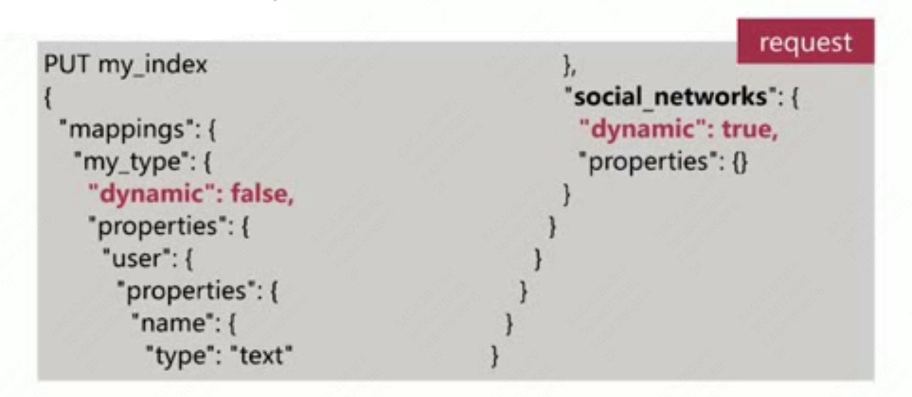

# 第4章 Elasticsearch 篇之Mapping 设置

## 4.1 mapping 简介

类似数据库中表结构定义，主要作用如下：

- 定义Index下的字段名（Field Name）
- 定义字段的类型，比如数值型、字符串型、布尔型等
- 定义倒排序索引相关的配置，比如是否索引、记录position等

## 4.2 自定义 mapping 

- 自定义Mapping的api如下所示：

- Mapping中的字段类型一旦设定后，禁止直接修改，原因如下：

  - Lucene实现的倒排序索引生成后不允许修改

    > 类型的修改会影响索引的生成方式

- 重新建立新的索引，然后reindex操作

- 允许新增字段

- 通过dynamic参数来控制字段的新增

  - true （默认）允许自动新增字段

  - false 不允许自动新增字段，但是文档可以正常写入，但无法对字段进行查询操作

  - strict 文档不能写入，报错

    

- 

4-3 -mapping演示

4-4 -copy_to参数说明

4-5 -index参数说明

4-9 -dynamic-mapping简介