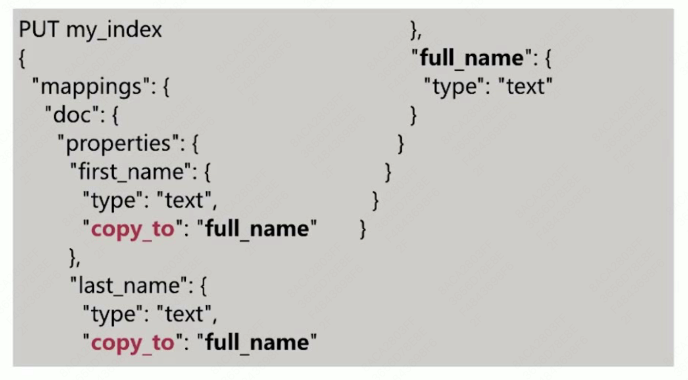
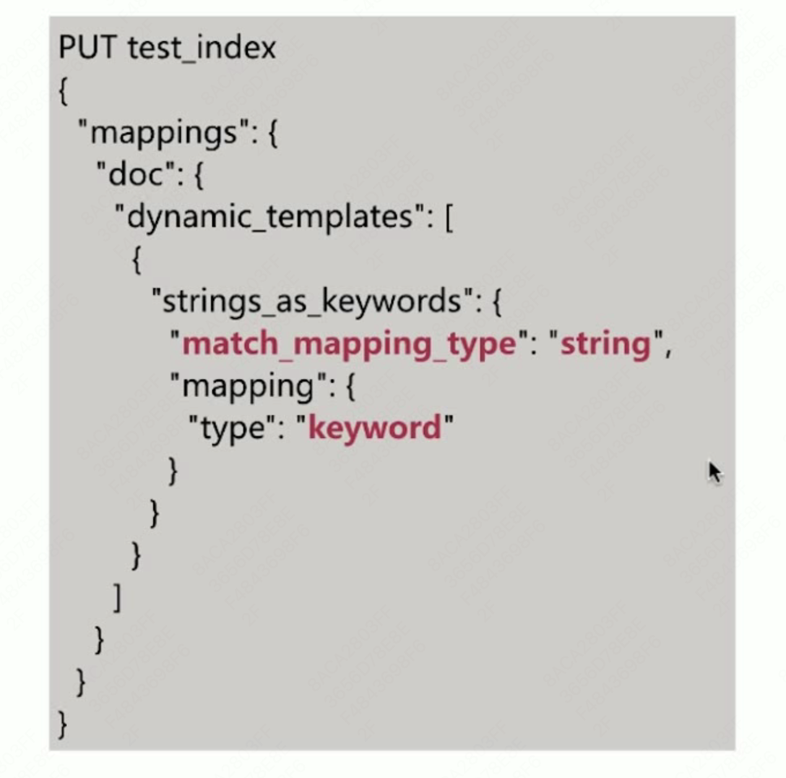

# 第4章 Elasticsearch 篇之Mapping 设置

[TOC]

## 4.1 mapping 简介

类似数据库中表结构定义，主要作用如下：

- 定义Index下的字段名（Field Name）
- 定义字段的类型，比如数值型、字符串型、布尔型等
- 定义倒排序索引相关的配置，比如是否索引、记录position等


## 4.2 自定义 mapping 

### 4.2.1 自定义Mapping的api

- 如下所示：


- Mapping中的字段类型一旦设定后，禁止直接修改，原因如下：

  - Lucene实现的倒排序索引生成后不允许修改

    > 类型的修改会影响索引的生成方式

- 重新建立新的索引，然后reindex操作

- 允许新增字段

- 通过dynamic参数来控制字段的新增

  - true （默认）允许自动新增字段

  - false 不允许自动新增字段，但是文档可以正常写入，但**无法对字段进行查询**操作

  - strict 文档不能写入，报错

    

  ```false
  
  GET /test_index/_mapping
  
  
  DELETE my_index
  
  PUT my_index
  {
    "mappings": {
      "dynamic":"false",
      "properties": {
        "title":{
          "type": "text"
        },
        "name":{
          "type": "keyword"
        },
        "age":{
          "type": "integer"
        }
      }
    }
  }
  
  GET /my_index/_mapping
  
  
  
  PUT my_index/_doc/1
  {
    "title":"hello,world",
    "name":"name test",
    "age":20
  }
  
  
  GET my_index/_search
  
  GET my_index/_search
  {
    "query": {
      "match": {
        "desc": "here"
      }
    }
  }
  
  dynamic 改成 strict 后再试一试
  ```


### 4.2.2 index_options

- index_options 用于控制倒排序索引记录的内容，有如下4种配置
  - docs 只记录 doc id
  - freqs 记录 doc id 和 term frequencies 
  - positions 记录 doc id 、term frequencies 和 term position 
  - offsets 记录doc id、doc id 、term frequencies 、term position 和 character offsets

- text 类型默认配置为 positions，其他默认为 docs

- 记录内容越多，占用空间越大

- index_options 设定如下所示

  

### 4.2.3 null_value

当字段遇到null值时的处理策略，默认为 null ，即空值，此时 es 会忽略该值。可以通过设定该值设定字段的默认值


注意：此时的 NULL 是字符串


### 4.2.4 官方文档

https://www.elastic.co/guide/en/elasticsearch/reference/7.17/mapping.html


## 4.3  copy_to参数说明

copy_to

- 将该字段的值复制到目标字段，实现类似 _all 的作用

- 不会出现 _source 中，只用来搜索

  


```json

#copy_to
PUT my_index1
{
  "mappings": {
    "properties": {
      "first_name":{
        "type": "text",
        "copy_to": "full_name"
      },
      "last_name":{
        "type": "text",
        "copy_to": "full_name"
      },
      "full_name":{
        "type": "text"
      }
    }
  }
}

PUT my_index1/_doc/1
{
  "first_name":"John",
  "last_name":"Smith"
}

#同时包含John Smith 2个单词的才搜索出来
GET my_index1/_search
{
  "query": {
    "match": {
      "full_name": {
        "query": "John Smith",
        "operator": "and"
      }
    }
  }
}

```


## 4.4 index参数说明

Index 

- 控制当前字段是否索引，默认true，即记录索引，false不记录，即不可搜索

  


"reason" : "Cannot search on field [cookie] since it is not indexed."

es一些字段不需要用来查询，比如一些敏感信息：身份证号码，手机号 


## 4.5 数据类型

- 核心数据类型

  - 字符串类型 text 、 keyword
  - 数值型：long 、integer、short、byte、double、float、half_float、scaled_float
  - 日期类型 date
  - 布尔类型 boolean
  - 二进制类型 binary
  - 范围类型 integer_range 、float_range、long_range、double_range、date_range

- 复杂数据类型

  - 数组类型 array
  - 对象类型 object
  - 嵌套类型 nested object

- 地理位置数据类型

  - geo_point
  - geo_shape

- 专用类型

  - 记录ip地址 ip
  - 实现自动补全 completion
  - 记录分词数 token_count
  - 记录字符串 hash 值 murmur3
  - percolator
  - join 

- 多字段特性 multi-fields

  - 允许对同一个字段采用不同的配置，比如分词，常见例子如对人名实现拼音搜索，只需要在人名中新增一个字段为pinyin即可

    


## 4.6 Dynamic Mapping

### 4.6.1 自动识别文档字段类型

es 可以自动识别文档字段类型，从而降低用户使用成本，如下所示：


es 是依靠json文档的字段类型来实现自动识别字段类型，支持的类型如下：


### 4.6.2 日期的自动识别

- 日期的自动识别可以自行配置日期格式，以满足各种需求
  - 默认是 ["strict_date_optional_time","yyyy/MM/dd HH:mm:dd Z||yyyy/MM/dd Z"]
  - strict_date_optional_time 是ISO datetime 的格式，完整格式类似下面：
    -  YYYY-MM-DDThh:mm:ssTZD （eg 1997-07-16T19:20:30+01:00）
  - dynamic_date_formats 可以自定义日期类型
  - date_detection 可以关闭日期自动识别的机制

例子：


### 4.6.3 数字自动识别

字符串是数字时，默认不会自动识别为整型，因为字符串中出现数字是完全合理的

- numeric_datection 可以开启字符串数字的自动识别，如下所示：

  

  

## 4.7 Dynamic Template

允许根据es自动识别的数据类型、字段名等来动态设定字段类型，可以实现如下效果：

- 所有字符串类型都设定为 keyword 类型，即默认不分词
- 所有以 message 开头的字段都设定为 text 类型，即分词
- 所有以 long_开头的字段都设定为 long 类型
- 所有匹配为 double 类型的都设定为 float 类型，以节省空间

API 如下所示：


匹配规则一般有如下几个参数：

- match_mapping_type 匹配es自动识别的字段类型，如boolean、long、string 等
- match、unmatch 匹配字段名
- path_match、path_unmath 匹配路径

举例：

字符串默认使用keyword类型

- es 默认会为字符串设置为 text 类型，并增加一个 keyword 的子字段

  


```json
DELETE test_index

PUT test_index
{
  "mappings": {
    "dynamic_templates":[
        {
          "strings_as_keywords":{
            "match_mapping_type":"string",
            "mapping":{
              "type":"keyword"
            }
          }
        }
      ]
  }
}

PUT test_index/_doc/1
{
  "name":"alfred",
  "message":"很漂亮"
}

GET test_index/_mapping
```

以message开头的字段都设置为text类型


匹配顺序是自上而下

```json
DELETE test_index

PUT test_index
{
  "mappings": {
    "dynamic_templates":[
        {
          "message_as_text":{
             "match_mapping_type":"string",
             "match":"message*",
             "mapping":{
               "type":"text"
             }
          }
        },
        {
          "strings_as_keywords":{
            "match_mapping_type":"string",
            "mapping":{
              "type":"keyword"
            }
          }
        }
      ]
  }
}

PUT test_index/_doc/1
{
  "name":"alfred",
  "message":"很漂亮"
}

GET test_index/_mapping
```

double类型设定为float，节省空间


## 4.8 自动Mapping的建议

### 4.8.1 自定义Mapping的操作步骤如下

1. 写入一条文档到es的临时索引中，获取es自动生成的mapping
2. 修改步骤1得到的mapping，自定义相关配置
3. 使用步骤2的mapping创建实际所需索引

灵活设置 dynamic_templates 可以减少设置mapping的工作量


## 4.9 索引模板

索引模板，Index Template，主要用于在新建索引时自动应用**预先设定的配置**，简化索引创建的操作步骤：

- 可以设定索引的配置和mapping
- 可以有多个模板，根据order设置，order大的覆盖小的配置


### 4.9.1 索引模板API

索引模板API，endpoint 为_template，如下所示：


```json
#索引模板
DELETE _template/test_template

PUT _template/test_template
{
  "index_patterns": ["te*","bar*"],
  "order": 0,
  "settings": {
    "number_of_shards": 1
  },
  "mappings": {
    "_source": {
      "enabled": false
    },
    "properties": {
      "name":{
        "type": "keyword"
      }
    }
  }
}
```


### 4.9.2 获取与删除的API

