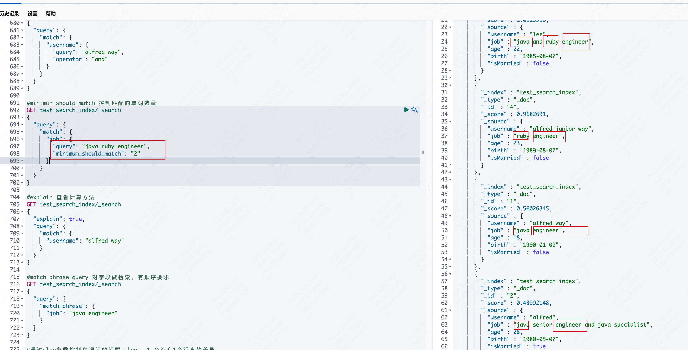
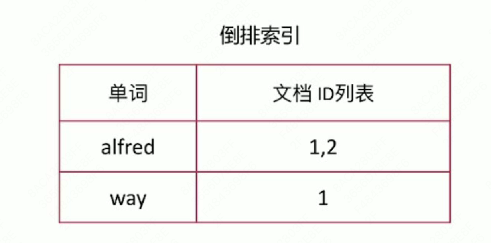
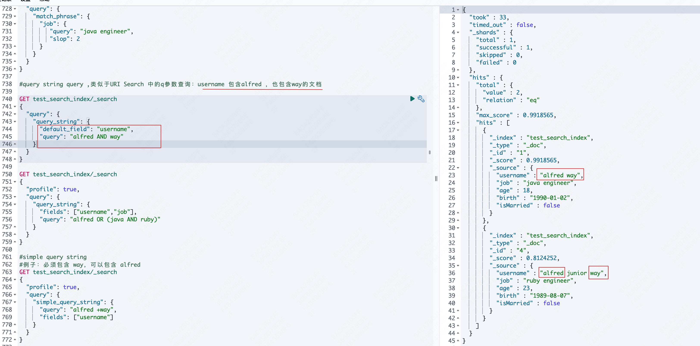
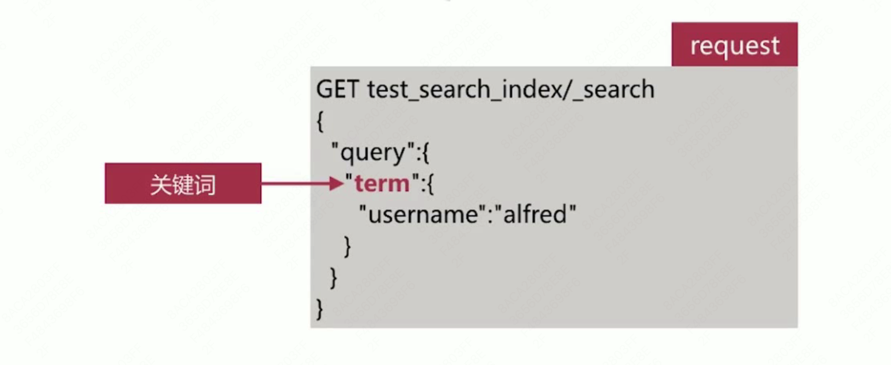
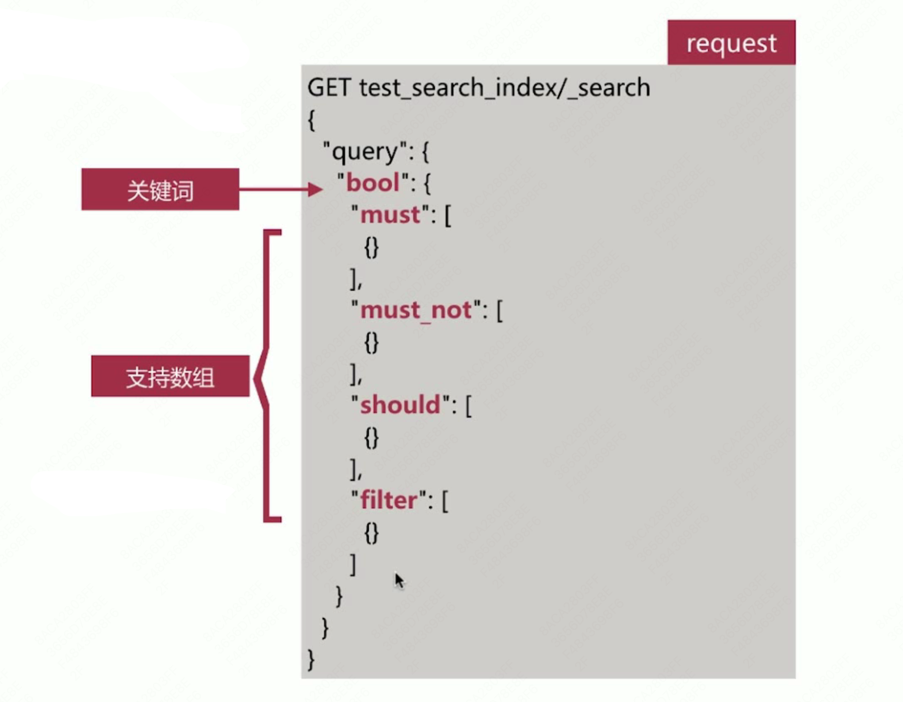
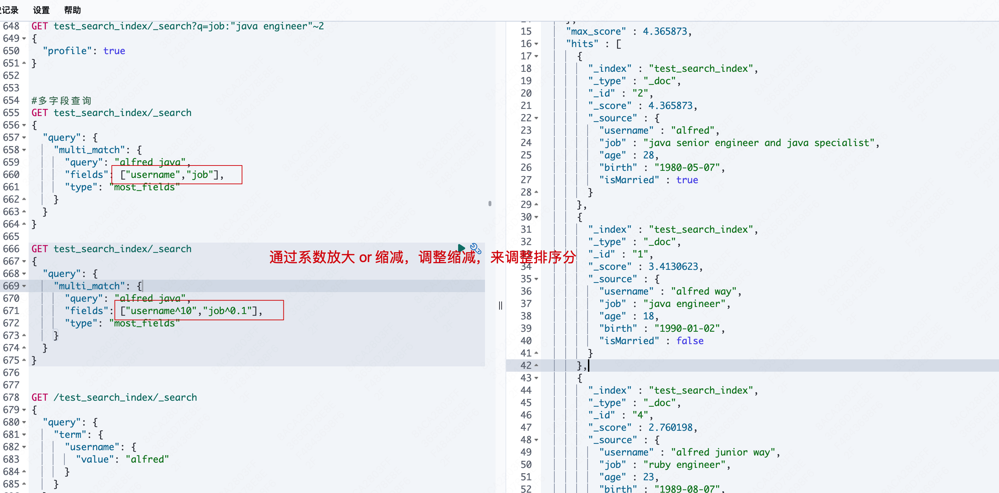

# 第5章 Elasticsearch 篇之Search API 介绍

## 5.1 Search API

实现对es中存储的数据进行查询分析，endpoint 为_search，如下所示：


查询主要有2种形式

- URI Search
  - 操作简便，方便通过命令行测试
  - 仅包含部分查询语法
- Request Body Search
  - es 提供的完备查询语法 Query DSL（Domain Specific Language）


## 5.2 URI Search

通过url query 参数来实现搜索，常用参数如下：

- q 指定查询的语句，语法为 Query String Syntax
- df q中不指定字段时默认查询的字段，如果不指定，es会查询所有字段（df = default field）
- sort 排序
- timeout 指定超时时间，默认不超时
- from , size 用于分页


### 5.2.1 URI Search - Query String Syntax

#### 5.2.1.1 文本查询

- term 与 phrase

  - alfred way 等效于 alfred OR way
  - “alfred way” 词语查询，要求先后顺序

- 泛查询

  - alfred 等效于在所有字段去匹配该 term

- 指定字段

  - name ： alfred

- Group 分组设定，使用括号指定匹配的规则

  - （quick OR brown）AND fox

  - status:(active OR pending)  title:(full text search)

    > status 为 active or status 为 pengding 的文档

    

示例：


词语查询：有前后顺序


加括号


```json
DELETE test_search_index

POST test_search_index/_bulk
{"index":{"_id":"1"}}
{"username":"alfred way","job":"java engineer","age":18,"birth":"1990-01-02","isMarried":false}
{"index":{"_id":"2"}}
{"username":"alfred","job":"java senior engineer and java specialist","age":28,"birth":"1980-05-07","isMarried":true}
{"index":{"_id":"3"}}
{"username":"lee","job":"java and ruby engineer","age":22,"birth":"1985-08-07","isMarried":false}
{"index":{"_id":"4"}}
{"username":"alfred junior way","job":"ruby engineer","age":23,"birth":"1989-08-07","isMarried":false}

GET test_search_index/_doc/1

#泛查询 是基于所有字段查询
GET test_search_index/_search?q=alfred
{
  "profile": true
}
#
GET test_search_index/_search?q=username:(alfred way)
{
  "profile": true
}

#查询 username 包含alfred，or 全文包含 way 的文档
GET test_search_index/_search?q=username:alfred way
{
  "profile": true
}

#加双引号，就是词语查询
GET test_search_index/_search?q=username:"alfred way"
{
  "profile": true
}
```


#### 5.2.1.2 布尔操作符

- AND (&&)、OR（||）,NOT（!）

  - name:(tom NOT lee) 

    > name包含 tom，但不包含 lee

  - 注意**大写**，不能小写

-  + - 分别对应must 和 must_not

  - name:(tom + lee - alfred)

    > name 一定包含lee，一定不包含 alfred，但是可以包含tom 的所有文档

  - name:((lee && !alfred)||(tom&&lee &&!alfred))

    > 等同于 name:(tom + lee - alfred)
    >
    > name 一定包含lee，一定不包含 alfred，但是可以包含tom 的所有文档

  - ​    + 在url中会被解析为空格，要使用encode 后的结果才可以，为 %2B

- 


包含alfred 或者 way


同时包含alfred 、way 2个词


#### 5.2.1.3 范围查询

范围查询：支持数值和日期

- 区间写法，闭区间用 [] ，开区间用 {}
  - age:[1 TO 10] 意为 1<= age <= 10
  - age:[1 To 10} 意为 1<= age < 10
  - age:[1 To ] 意为  age >=1
  - age:[* To 10] 意为 age <=10
- 算数符号写法
  - age:>=1
  - age:(>=1 && <=10) 或者 age:(+>=1 +<=10)


范围查询支持日期


#### 5.2.1.4 通配符查询

通配符查询

- ？代表1个字符，* 代表0或多个字符
  - name:t?m
  - name:tom*
  - name:t*m
- 通配符匹配执行效率低，且占用较多内存，不建议使用
- 如无特殊需求，不要将 ？/ * 放在前面


#### 5.2.1.5 正则表达式查询

- name:/[mb]oat/

  > name中包含 moat 或者 boat的文档
  >
  > 

- 比较吃内存


#### 5.2.1.6 模糊匹配 

fuzzy query

- 单词：name:roam~1
  - 匹配与roam差1个character的词，比如foam roams 等
- 词语：近似度查询 proximity search
  - "fox quick"~5
  - 以term为单位进行差异比较，比如"quick fox" "quick brown fox"都会匹配
- 一般用在用户输入词的纠错场景


```json
DELETE test_search_index

POST test_search_index/_bulk
{"index":{"_id":"1"}}
{"username":"alfred way","job":"java engineer","age":18,"birth":"1990-01-02","isMarried":false}
{"index":{"_id":"2"}}
{"username":"alfred","job":"java senior engineer and java specialist","age":28,"birth":"1980-05-07","isMarried":true}
{"index":{"_id":"3"}}
{"username":"lee","job":"java and ruby engineer","age":22,"birth":"1985-08-07","isMarried":false}
{"index":{"_id":"4"}}
{"username":"alfred junior way","job":"ruby engineer","age":23,"birth":"1989-08-07","isMarried":false}

GET test_search_index/_doc/1

#泛查询 是基于所有字段查询
GET test_search_index/_search?q=alfred
{
  "profile": true
}
#
GET test_search_index/_search?q=username:(alfred way)
{
  "profile": true
}

#查询 username 包含alfred，or 全文包含 way 的文档
GET test_search_index/_search?q=username:alfred way
{
  "profile": true
}

#加双引号，就是词语查询
GET test_search_index/_search?q=username:"alfred way"
{
  "profile": true
}


GET test_search_index/_search?q=username:alfred AND way
{
  "profile": true
}


GET test_search_index/_search?q=username:(alfred AND way)
{
  "profile": true
}

GET test_search_index/_search?q=username:(alfred NOT way)
{
  "profile": true
}

GET test_search_index/_search?q=username:(alfred +way)
{
  "profile": true
}

GET test_search_index/_search?q=username:(alfred %2Bway)
{
  "profile": true
}

#username 包含alfred，或者 age>20的文档
GET test_search_index/_search?q=username:alfred age:>20
{
  "profile": true
}

#username 包含alfred，并且 age>20的文档
GET test_search_index/_search?q=username:alfred AND age:>20
{
  "profile": true
}


GET test_search_index/_search?q=birth:(>1980 AND 1990)
{
  "profile": true
}

#查询username 以alf开头的所有文档
GET test_search_index/_search?q=username:alf*
{
  "profile": true
}

#a开头，l后面任意字符, ?表示前面的a可有可无
GET test_search_index/_search?q=username:/[a]?l.*/
{
  "profile": true
}


GET test_search_index/_search?q=username:alfed~1
{
  "profile": true
}

GET test_search_index/_search?q=job:"java engineer"~1
{
  "profile": true
}

GET test_search_index/_search?q=job:"java engineer"~2
{
  "profile": true
}

```


## 5.3 Query DSL

### 5.3.1 Request Body Search

将查询语句通过http request body 发送到 es，主要包含如下参数：

- query 符合 Query DSL 语法的查询语句
- from , size 
- timeout
- sort
- ....
- 

### 5.3.2 Query DSL

基于 JSON 定义的查询语言，主要包含如下2种类型：

- 字段类查询

  - 如 term、match、range 等，只针对某一个字段进行查询

    > term：词的查询
    >
    > match：全文检索
    >
    > range：范围查询

- 复合查询

  - 如 bool 查询等，包含一个或多个字段类查询或者符合查询语句

#### 5.3.2.1 Query DSL - 字段类查询

字段类查询主要包括以下2类：

- 全文匹配
  - 针对 text 类型的字段进行全文检索，会对查询语句先进行分词处理，如：match 、match_phrase 等 query 类型
- 单词匹配
  - 不会对查询语句做分词处理，直接去匹配字段的倒排索引，如：term 、 terms、range 等query 类型


#### 5.3.2.2 Match Query

对字段做全文检索，最基本和常用的查询类型，API示例如下：


可以用GET ，也可以用POST


_source : 存储的是原始内容


##### 5.3.2.2.1 match query - 流程


##### 5.3.2.2.2 match query - operator

通过 operator 参数可以控制单词间的匹配关系，可选项为 or 和 and


必须同时包含 alfred 和 way 的结果


##### 5.3.2.2.3 match query - minimum_should_match

通过minimum_should_match参数可以控制需要匹配的单词数





##### 5.3.2.2.4 match query - multi_match

多字段查询


## 5.4 相关性算分


相关性算分是指文档与查询语句间的相关度，英文为 relevance

- 通过倒排索引可以获取与查询语句相匹配的文档列表，那么如何将最符合用户查询需求的文档放到前列呢？

- 本质是一个排序问题，排序的依据是相关性算分

  

- 相关性算分的几个重要概念如下：

  - Term Frequency（TF）词频，即单词在该文档中出现的次数。词频越高，相关度越高
  - Document Frequency （DF）文档频率，即单词出现的文档数
  - Inverse Document Frequency （IDF）逆向文档频率，与文档频率相反，简单理解为 **1/DF**。即单词出现的文档数越少，相关度越高
  - Field-length Norm 文档越短，相关度越高

- ES 目前主要有2个相关性算分模型，如下：

  - TF/IDF 模型
  - BM25 模型 5.x之后的默认模型

  

### 5.4.1 相关性算法 - TF / IDF

TF/IDF 模型是Lucene 的经典模型，其计算公式如下：


> coord(q,d) . queryNorm(q) : 对query 做正则化处理
>
> t.getBoost() : 是否做过特定的加权，自定义影响相关性得分

可以通过 `explain ` 参数来查看具体的计算方法，但要注意：

- es 的算分是按照 shard 进行的，即 shard 的分数计算是相互独立的，所以在使用 explain 的时候主要分片数

- 可以通过设置索引的分片数为1 来避免这个问题

  


```json
#explain 查看计算方法
GET test_search_index/_search
{
  "explain": true,
  "query": {
    "match": {
      "username": "alfred way"
    }
  }
}
```


### 5.4.2 相关性算分 - BM25模型

BM25模型中BM指Best Match，25 指跌代了25次才计算方法，是针对TF/IDF 的一个优化，其计算公式如下：


> 5.X之后是默认的算分模型

BM25 相比 TF/IDF 的一大优化是降低了 TF 在过大时的权重


> 经典的 TF/IDF score 会无限增大
>
>  BM25 可以消除


## 5.5 Match Phrase Query

### 5.5.1 对字段做检索，有顺序要求

API示例如下：


> match_phrase : 有顺序

### 5.5.2 通过slop 参数可以控制单词间的间隔


> 允许 java engineer 之间有1个距离的差异


## 5.6 Query String Query

类似于 URI Search 中的 q 参数查询





```json

#query string query ,类似于URI Search 中的q参数查询：username 包含alfred ，也包含way的文档

GET test_search_index/_search
{
  "query": {
    "query_string": {
      "default_field": "username",
      "query": "alfred AND way"
    }
  }
}

GET test_search_index/_search
{
  "profile": true, 
  "query": {
    "query_string": {
      "fields": ["username","job"],
      "query": "alfred OR (java AND ruby)"
    }
  }
}

#simple query string
#例子：必须包含 way，可以包含 alfred
GET test_search_index/_search
{
  "profile": true,
  "query": {
    "simple_query_string": {
      "query": "alfred +way",
      "fields": ["username"]
    }
  }
}
```


## 5.7 Simple Query String Query

- 类似Query String，但是会忽略错误的查询语法，并且仅支持部分查询语法

- 其常用的逻辑符号如下，**不能使用 AND、OR、NOT 等关键词**：

  - "+" 代指AND

  - "|" 代指OR

  - "-"  代指NOT

    

  

 

```json
#simple query string
#例子：必须包含 way，可以包含 alfred
GET test_search_index/_search
{
  "profile": true,
  "query": {
    "simple_query_string": {
      "query": "alfred +way",
      "fields": ["username"]
    }
  }
}

GET test_search_index/_search
{
  "profile": true,
  "query": {
    "simple_query_string": {
      "query": "alfred +way AND java",
      "fields": ["username"]
    }
  }
}
```


## 5.8 Term/Terms Query

### 5.8.1 Term Query

将查询语句作为整个单词进行查询，即不对查询语句做分词处理，如下所示：



### 5.8.2 Terms Query

允许一次传入多个单词进行查询，如下所示：


示例：


## 5.9 Range Query

### 5.9.1 范围查询主要针对数值和日期类型

如下所示：


针对日期做查询如下所示：


便于实现最近1小时、最近1周这样的需求

### 5.9.2 Date Math

针对日期提供的一种更友好地计算方式，格式如下：


单位主要有如下几种：

- y - years
- M - months
- w - weeks
- d - days
- h - hours
- m - minutes
- s - seconds


假设now 为 2018-01-02 12:00:00 ，那么如下的计算结果实际为：


```json

#range query 范围查询,主要针对数值 和 日期
GET test_search_index/_search
{
  "query": {
    "range": {
      "age": {
        "gte": 10,
        "lte": 20
      }
    }
  }
}

GET test_search_index/_search
{
  "query": {
    "range": {
      "birth": {
        "gte": "1990-01-01"
      }
    }
  }
}

GET test_search_index/_search
{
  "query": {
    "range": {
      "birth": {
        "gte": "now-40y"
      }
    }
  }
}

GET test_search_index/_search
{
  "query": {
    "range": {
      "birth": {
        "gte": "2010||-20y"
      }
    }
  }
}
```


## 5.10 Query DSL 复合查询

复合查询时指包含**字段类查询**或**复合查询**的类型，主要包括以下几类：

- **constant_score query**
- **bool query**
- dis_max query
- function_score query
- boosting query

### 5.10.1 constant_score query

该查询将其内部的查询结果文档得分都设定为1或者boost的值

- 多用于结合 bool 查询实现自定义得分

  


```json
#Constant Score Query
GET test_search_index/_search
{
  "query": {
    "constant_score": {
      "filter": {
        "match":{
          "username":"alfred"
        }
      },
      "boost": 1.2
    }
  }
}
```


## 5.11 Bool Query

布尔查询由一个或多个布尔子句组成，主要包含如下4个：


Bool 查询的API 如下所示：



### 5.11.1 Filter

Filter 查询只过滤符合条件的文档，不会进相关性算分

- es 针对 filter 会有智能缓存，因此其执行效率很高

- 做简单匹配查询且不考虑算分时，推荐使用 filter 替代 query等

  

> 计算相关性得分比较消耗时间


```json
#Bool Query Filter 
#Es 针对filter 会有智能缓存，因此执行效率很高
#做简单匹配查询不考虑算分时，推荐使用filter替代query等
GET test_search_index/_search
{
  "query": {
    "bool": {
      "filter": [
        {
          "term": {
            "username": "alfred"
          }
        }
      ]
    }
  }
}
```


### 5.11.2 must


```json
GET test_search_index/_search
{
  "profile": true, 
  "query": {
    "bool": {
      "must": [
        {
          "match": {
            "username": "alfred"
          }
        },
        {
          "match": {
            "job": "specialist"
          }
        }
      ]
    }
  }
}
```

### 5.11.3 must_not


```json
GET test_search_index/_search
{
  "query": {
    "bool": {
      "must": [
        {
          "match": {
            "job": "java"
          }
        }
      ],
      "must_not": [
        {
          "match": {
            "job": "ruby"
          }
        }
      ]
    }
  }
}
```


### 5.11.4 should

should 使用分2种情况：

- bool 查询中**只包含** **should 、 不包含 must** 查询
- bool 查询中同时包含 **should** 和 **must** 查询


只包含should 时，文档必须满足至少一个条件

- minimum_should_match 可以控制满足条件的个数或者百分比

  

```json

#should 查询，文档必须满足至少一个条件,minimum_should_match 可以控制满足条件的个数或百分比
GET test_search_index/_search
{
  "query": {
    "bool": {
      "should": [
        {"term": {"job": "java"}},
        {"term": {"job": "ruby"}},
        {"term": {"job": "specialist"}}
      ],
      "minimum_should_match": 2
    }
  }
}
```


同时包含should 和 must 时，文档不必满足should 中的条件，但是如果满足条件，会增加相关性得分


```json

#Constant Score Query
GET test_search_index/_search
{
  "query": {
    "constant_score": {
      "filter": {
        "match":{
          "username":"alfred"
        }
      },
      "boost": 1.2
    }
  }
}

#查询模板
GET test_search_index/_search
{
  "query": {
    "bool": {
      "must": [
        {}
      ],
      "must_not": [
        {}
      ],
      "should": [
        {}
      ],
      "filter": [
        {}
      ]
    }
  }
}


#Bool Query Filter 
#Es 针对filter 会有智能缓存，因此执行效率很高
#做简单匹配查询不考虑算分时，推荐使用filter替代query等
GET test_search_index/_search
{
  "query": {
    "bool": {
      "filter": [
        {
          "term": {
            "username": "alfred"
          }
        }
      ]
    }
  }
}

GET test_search_index/_search
{
  "profile": true, 
  "query": {
    "bool": {
      "must": [
        {
          "match": {
            "username": "alfred"
          }
        },
        {
          "match": {
            "job": "specialist"
          }
        }
      ]
    }
  }
}

GET test_search_index/_search
{
  "query": {
    "bool": {
      "must": [
        {
          "match": {
            "job": "java"
          }
        }
      ],
      "must_not": [
        {
          "match": {
            "job": "ruby"
          }
        }
      ]
    }
  }
}

#should 查询，文档必须满足至少一个条件,minimum_should_match 可以控制满足条件的个数或百分比
GET test_search_index/_search
{
  "query": {
    "bool": {
      "should": [
        {"term": {"job": "java"}},
        {"term": {"job": "ruby"}},
        {"term": {"job": "specialist"}}
      ],
      "minimum_should_match": 2
    }
  }
}

#同时包含should和must时，文档不必满足should中的条件，但是如果满足条件，会增加相关得分
GET test_search_index/_search
{
  "query": {
    "bool": {
      "must": [
        {"term": {"username": "alfred"}}
      ],
      "should": [
        {"term": {"job": "ruby"}}
      ]
    }
  }
}

GET test_search_index/_search
{
  "_source": false, 
  "query": {
    "bool": {
      "must": [
        {"term": {"username": "alfred"}}
      ],
      "should": [
        {"term": {"job": "ruby"}}
      ]
    }
  }
}
```


### 5.11.5 Query Context VS Filter Context

当一个查询语句位于 Query 或者 Filter 上下文时，es 执行的结果会不同，对比如下：


> 不需要算分的放到 filter 里面
>
> 全文检索的放 must 里面，让其做相关性算分

```josn

#同时包含should和must时，文档不必满足should中的条件，但是如果满足条件，会增加相关得分
GET test_search_index/_search
{
  "query": {
    "bool": {
      "must": [
        {"term": {"username": "alfred"}}
      ],
      "should": [
        {"term": {"job": "ruby"}}
      ]
    }
  }
}

GET test_search_index/_search
{
  "_source": false, 
  "query": {
    "bool": {
      "must": [
        {"term": {"username": "alfred"}}
      ],
      "should": [
        {"term": {"job": "ruby"}}
      ]
    }
  }
}

GET test_search_index/_search
{
  "_source": ["username","age"], 
  "query": {
    "bool": {
      "must": [
        {"term": {"username": "alfred"}}
      ],
      "should": [
        {"term": {"job": "ruby"}}
      ]
    }
  }
}


GET test_search_index/_search
{
  "_source": {
    "includes": "*i*",
    "excludes": "birth"
  },
  "query": {
    "bool": {
      "must": [
        {"term": {"username": "alfred"}}
      ],
      "should": [
        {"term": {"job": "ruby"}}
      ]
    }
  }
}


GET test_search_index/_search
{
  "query": {
    "bool": {
      "must": [
        {"match": {
          "title": "Search"
        }},
        {
          "match": {
            "content": "Elasticsearch"
          }
        }
      ],
      "filter": [
        {"term": {
          "status": "published"
        }},
        {
          "range": {
            "publish_date": {
              "gte": "1980-01-01"
            }
          }
        }
      ]
    }
  }
}
```


## 5.12 Count API 

获取符合条件的文档数，endpoint 为 _count 


```josn
#count API
GET test_search_index/_count
{
  "query": {
    "match": {
      "username": "alfred"
    }
  }
}
```


## 5.13 Source Filtering

过滤返回结果中 _source 中的字段，主要有如下几种方式：


```json
GET test_search_index/_search
{
  "_source": false, 
  "query": {
    "bool": {
      "must": [
        {"term": {"username": "alfred"}}
      ],
      "should": [
        {"term": {"job": "ruby"}}
      ]
    }
  }
}

GET test_search_index/_search
{
  "_source": ["username","age"], 
  "query": {
    "bool": {
      "must": [
        {"term": {"username": "alfred"}}
      ],
      "should": [
        {"term": {"job": "ruby"}}
      ]
    }
  }
}


GET test_search_index/_search
{
  "_source": {
    "includes": "*i*",
    "excludes": "birth"
  },
  "query": {
    "bool": {
      "must": [
        {"term": {"username": "alfred"}}
      ],
      "should": [
        {"term": {"job": "ruby"}}
      ]
    }
  }
}

```


## 5.14 查全率查准率

- **查全率：**正确的结果有n个，查询出来正确的有m ，m/n
- **查准率：**查出的n 个文档有m个正确 m/n
- 两者不可兼得，但可以调整排序




```json

#多字段查询
GET test_search_index/_search
{ 
  "query": {
    "multi_match": {
      "query": "alfred java",
      "fields": ["username","job"],
      "type": "most_fields"
    }
  }
}

GET test_search_index/_search
{ 
  "query": {
    "multi_match": {
      "query": "alfred java",
      "fields": ["username^10","job^0.1"],
      "type": "most_fields"
    }
  }
}
```

但是不够灵活，可以用 functionscore 自定义得分


