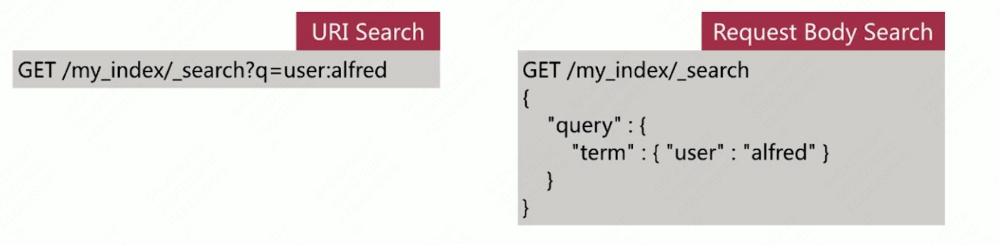

# 第5章 Elasticsearch 篇之Search API 介绍

## 5.1 Search API

实现对es中存储的数据进行查询分析，endpoint 为_search，如下所示：

查询主要有2种形式

- URI Search
  - 操作简便，方便通过命令行测试
  - 仅包含部分查询语法
- Request Body Search
  - es 提供的完备查询语法 Query DSL（Domain Specific Language）

